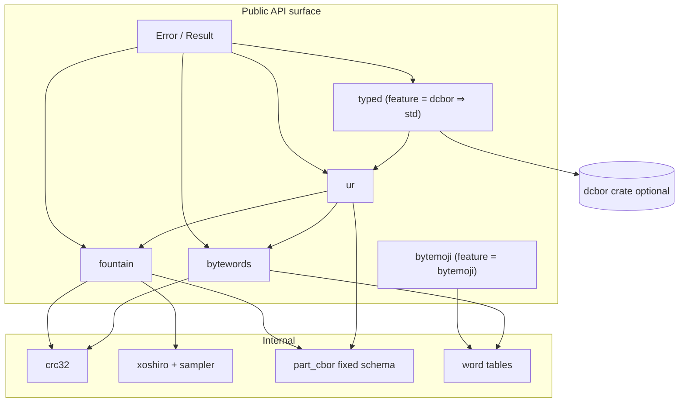
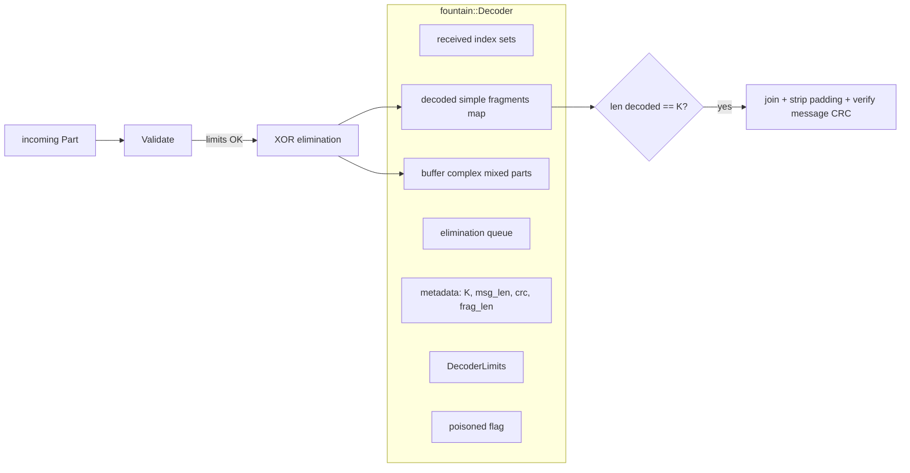
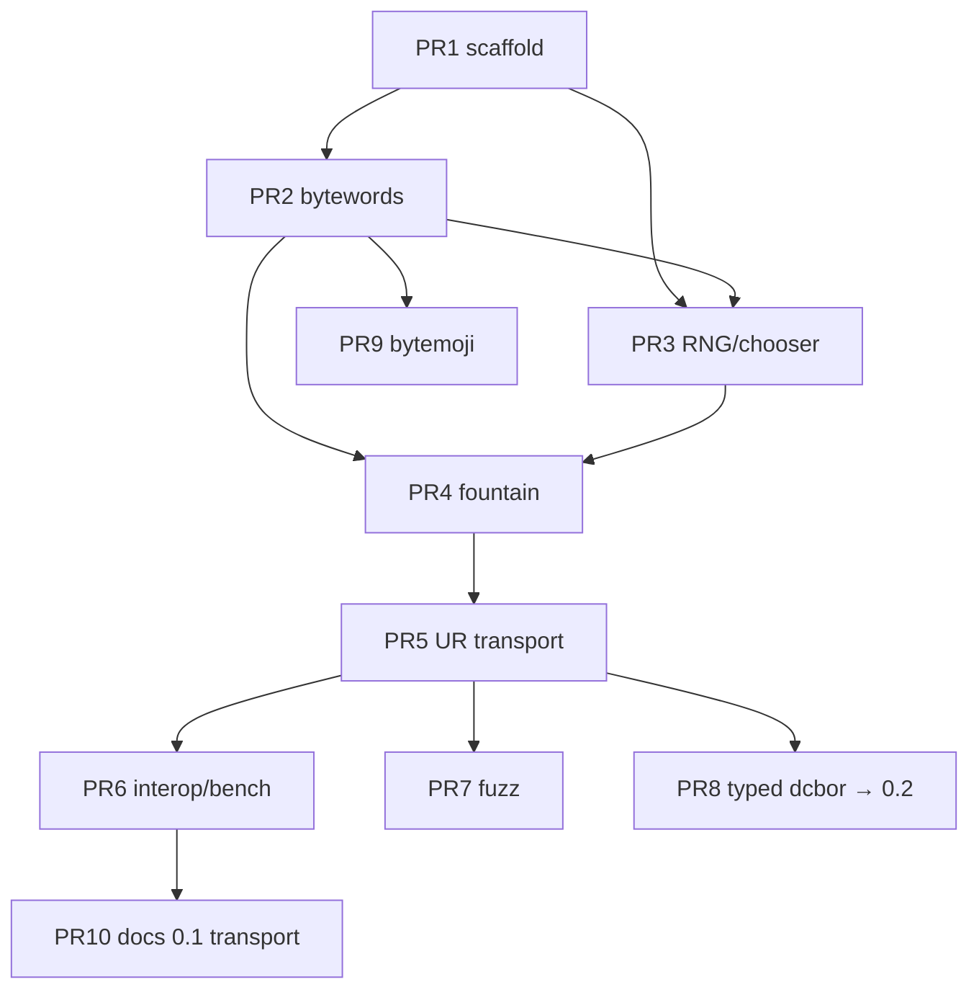

# bcur: Optimal Modern Rust Uniform Resources Library (2026)

| Field | Value |
|-------|-------|
| **Document** | Design Specification |
| **Author** | QNTX / bcur maintainers |
| **Date** | 2026-07-22 |
| **Status** | Draft (rev 3 — parse ownership + API polish) |
| **Target crate** | `bcur` (`crates/bcur`) |
| **Repository** | https://github.com/qntx/bcur |
| **MSRV** | 1.85 (edition 2024) |
| **License** | MIT OR Apache-2.0 |

---

## Overview

Uniform Resources (URs) encode binary payloads as URI-friendly strings optimized for QR codes and unreliable channels. A UR string is either **single-part** (`ur:<type>/<bytewords>`) or **multi-part fountain** (`ur:<type>/<seq>-<count>/<bytewords>`), where multi-part uses a Luby-transform-style fountain code seeded by Xoshiro256** and SHA-256 so any sufficient subset of parts reconstructs the original payload.

This document designs a **first-class, production-grade** Rust implementation for the QNTX `bcur` workspace. It synthesizes:

- **Transport correctness** from [dspicher/ur-rs](https://github.com/dspicher/ur-rs) (`ur` 0.5.0): owned fountain codes, `no_std`+`alloc`, CRC-validated bytewords, progress reporting, fuzz/bench culture.
- **Domain ergonomics** from [BlockchainCommons/bc-ur-rust](https://github.com/BlockchainCommons/bc-ur-rust) (`bc-ur` 0.19.2): typed `UR` value objects, dCBOR integration, `UREncodable`/`URDecodable` traits, QR helpers, bytemoji identifiers — **without** wrapping a third-party transport crate and **without** copying BSD-2-Clause-Patent source.

The result is a layered single-crate library that **owns** bytewords + fountain + UR wire format, optionally layers dCBOR-typed APIs behind a feature flag, forbids panics in the public surface, unifies errors under `core::error::Error`, and is wire-compatible with ur-rs, bc-ur, URKit (Swift), and bc-ur (C++).

---

## Background & Motivation

### What URs are

Per [BCR-2020-005](https://github.com/BlockchainCommons/Research/blob/master/papers/bcr-2020-005-ur.md):

1. **Bytewords** ([BCR-2020-012](https://github.com/BlockchainCommons/Research/blob/master/papers/bcr-2020-012-bytewords.md)): 256 carefully chosen 4-letter English words; three styles (standard/space, URI/dash, minimal 2-letter concat). Every encoding appends a CRC-32 (ISO-HDLC) checksum of the payload.
2. **UR scheme**: `ur:` + type token (`[a-z0-9-]+`) + `/` + body. Multi-part inserts `SEQ-COUNT/` before the body.
3. **Fountain parts**: payload fragments mixed via XOR; degree selection via inverse-weight sampling; RNG seeded from sequence number + message checksum so encoder and decoder agree without side channels.
4. **Fountain part CBOR**: fixed 5-element array `[sequence, sequenceCount, messageLength, checksum, data]` (unsigned integers + byte string), then bytewords-minimal encoded into the URI body.
5. **Domain convention (Gordian)**: UR *payloads* for application types are typically **dCBOR** (deterministic CBOR). Transport itself is type-agnostic bytes.

### Current state of the ecosystem

| Crate | Role | Strengths | Weaknesses |
|-------|------|-----------|------------|
| `ur` 0.5.0 | Low-level transport | Full fountain, `no_std`, interop vectors, fuzz, progress APIs | Split module errors; panicking `encode`; no dCBOR; no bytemoji; flat/stringly type API; minicbor for fixed-schema part CBOR; **no decoder resource limits** |
| `bc-ur` 0.19.2 | High-level Gordian wrapper | Typed `UR`, dCBOR traits, thiserror, QR helpers, bytemoji; **working** thin multipart wrappers + fountain tests | Depends on older `ur` ^0.4; multipart is a **thin wrapper** over `ur` (no progress API, no limits, no owned fountain); panics if tag unregistered; **std-only**; BSD-2-Clause-Patent |

### Pain points this design solves

1. **No production dual-layer crate** under MIT/Apache dual license that owns transport *and* offers optional typed dCBOR APIs.
2. **Error UX**: consumers of `ur` must handle three error enums; `bc-ur` loses structure by stringifying upstream errors.
3. **Panic surface**: `ur::encode` and `UREncodable::ur` default can panic.
4. **Feature coupling**: wanting dCBOR currently forces std (v1 policy) and should not require two crates with version skew.
5. **Adversarial input**: fountain decoders can grow unbounded maps/buffers without explicit resource limits — unacceptable for wallets scanning untrusted QR streams.
6. **Scaffold debt**: `bcur` Makefile/CI still reference unrelated `kobe-*` crates; library is a placeholder `add` function.

### Existing scaffold constraints (must preserve)

Path: `/Users/xu/Desktop/qntx/bcur`

- Workspace `edition = "2024"`, `rust-version = "1.85"`, dual MIT OR Apache-2.0
- Single member `crates/bcur`
- Strict workspace lints: `unsafe_code = deny`, clippy pedantic/nursery, `missing_docs = warn`, `unwrap_used`/`panic`/`expect_used` warn
- CI: lint, test, no_std cross-check (currently misconfigured for kobe template)
- Keywords currently `["crypto", "bcur"]`; category `cryptography::cryptocurrencies` — expand at publish (see Key Decisions)

---

## Goals & Non-Goals

### Goals

1. **Wire interoperability** with ur-rs 0.5, bc-ur, and Blockchain Commons reference vectors for single-part and multi-part URs.
2. **Own the transport stack**: bytewords, fountain (Xoshiro + sampler + XOR elimination), UR parse/format — not a re-export of `ur`.
3. **Layered API**: bytes-level transport always available; optional dCBOR value types and traits.
4. **`no_std` + `alloc` first-class** for core transport; `std` default; dCBOR gated and implies `std` in v1.
5. **Modern error model**: single `bcur::Error` implementing `core::error::Error` (stable since 1.81; available under both `std` and `no_std` builds), `Result` throughout public API.
6. **Security hygiene**: CRC validation, type validation, concrete decoder resource limits, no panics in public API.
7. **Test culture**: interop vectors, property tests, fuzz targets, benches, cargo-deny.
8. **Implementable design**: concrete modules, types, features, normative algorithms, and ordered PRs.

### Non-Goals

1. Implementing the full Gordian Envelope / crypto-request type registry (consumers use traits).
2. Replacing `dcbor` with a custom CBOR stack for application payloads.
3. Copying BSD-2-Clause-Patent source from `bc-ur` into this tree.
4. QR *image* generation (only uppercase string/byte helpers; apps use `qrcode` etc.).
5. Pure `no_alloc` / heapless operation (fountain needs dynamic buffers; out of scope for v1). **There is no `alloc` Cargo feature** — the `alloc` crate is always required via `extern crate alloc`.
6. Supporting non-UR “legacy BC32” encodings except as documented future work.
7. File-level vendoring of ur-rs sources (see Alternatives; algorithm-compatible reimplementation preferred).

---

## Proposed Design

### Architecture decision: single crate, layered modules

**Choice: one crate `bcur` with feature-gated layers.**

| Option | Pros | Cons |
|--------|------|------|
| **A. Single crate + features (chosen)** | One version, no skew; features express cost; matches ~3–4k LOC scale; simple docs.rs | Larger feature matrix to test |
| B. Two crates (`bcur-core` + `bcur`) | Hard no_std boundary | Version coupling; dual publish; thin domain crate becomes bc-ur again |
| C. Re-export `ur` + wrap | Fast to ship | Violates “own the implementation”; inherits API debt; dependency on external crate evolution |

Justification: transport is ~2.5–3k LOC; domain layer ~300–600 LOC. Feature flags (`std`, `dcbor`, `bytemoji`) cleanly express the matrix without multi-crate ceremony. Internal modules enforce layering; public re-exports form the stable surface.



### Layer model

| Layer | Modules | Depends on | Feature |
|-------|---------|------------|---------|
| **L0 Foundations** | `error`, `crc32`, `constants` (word tables) | `crc` | always (`alloc` always required; not a feature) |
| **L1 Bytewords** | `bytewords` | L0 | always |
| **L2 Fountain** | `fountain`, `xoshiro`, `sampler`, `part_cbor` | L0 + SHA-256 | always |
| **L3 UR transport** | `ur` | L1+L2 | always |
| **L4 Typed domain** | `typed` | L3 + `dcbor` | `dcbor` (implies `std`) |
| **L5 Extras** | `bytewords::bytemoji`, QR helpers | L1/L3 | `bytemoji` / always for QR strings |

Default features: `["std"]`. Core compiles with `--no-default-features` and always uses `extern crate alloc` (no `alloc` feature flag).

### Module layout (target tree)

```
crates/bcur/
  Cargo.toml
  src/
    lib.rs                 # crate docs, re-exports, features
    error.rs               # unified Error + Result
    crc32.rs               # CRC_32_ISO_HDLC helper
    constants.rs           # BYTEWORDS, MINIMALS (+ optional BYTEMOJIS)
    bytewords/
      mod.rs               # Style, encode, decode, encode_raw, canonicalize
      bytemoji.rs          # cfg(feature = "bytemoji")
    fountain/
      mod.rs               # Encoder, Decoder, Part, DecoderLimits
      encoder.rs
      decoder.rs
      part.rs
      part_cbor.rs         # fixed 5-array CBOR (no general CBOR dep)
      choose.rs            # choose_fragments, fragment_length, partition
    rng/
      mod.rs
      xoshiro.rs           # Xoshiro256** seed from SHA-256 (normative)
      sampler.rs           # Walker's alias method (Weighted)
    ur/
      mod.rs               # encode, decode, parse, Kind
      type_name.rs         # UrType validation
      encoder.rs           # multi-part UR Encoder
      decoder.rs           # multi-part UR Decoder + progress + limits + type stickiness
      parse.rs             # scheme/type/indices parsing (full-URI case fold)
    typed/                 # cfg(feature = "dcbor")
      mod.rs
      ur_value.rs          # Ur { type, cbor }
      traits.rs            # UrEncodable / UrDecodable / UrCodable
      multipart.rs         # MultipartEncoder / MultipartDecoder
  tests/
    interop_ur_rs.rs
    interop_bc_ur.rs
    adversarial_decoder.rs
  benches/
    bytewords.rs
    fountain.rs
    ur_roundtrip.rs
  examples/
    qr_string.rs
    multipart_progress.rs
fuzz/
  fuzz_targets/
    bytewords_decode.rs
    fountain_roundtrip.rs
    ur_receive.rs
    part_cbor.rs
```

### Feature matrix

| Feature | Default | Effect |
|---------|---------|--------|
| `std` | **yes** | Host builds; still uses `alloc`. Enables nothing transport-critical. |
| `dcbor` | no | **Implies `std`.** Pulls `dcbor` with its `std` feature; enables `typed` module. |
| `bytemoji` | no | Enables bytemoji tables + identifier helpers ([BCR-2024-008](https://github.com/BlockchainCommons/Research/blob/master/papers/bcr-2024-008-bytemoji.md)) |

**There is no `alloc` Cargo feature.** Do not port the kobe template's `features = ["alloc"]` pattern.

Cargo sketch:

```toml
[package]
name = "bcur"
version.workspace = true
edition.workspace = true
rust-version.workspace = true
license.workspace = true

[features]
default = ["std"]
std = []
# Typed dCBOR layer. Forces std in v1 (dcbor dependency built with std).
dcbor = ["dep:dcbor", "std"]
bytemoji = []

[dependencies]
crc = "3"
bitcoin_hashes = { version = "1", default-features = false }
rand_xoshiro = "0.8"
thiserror = { version = "2", default-features = false }
dcbor = { version = "0.25", optional = true, default-features = false, features = ["std"] }

[dev-dependencies]
hex = "0.4"
proptest = "1"
criterion = "0.8"
# Required for Part CBOR equality tests against ur-rs wire form (PR 4).
minicbor = { version = "2", features = ["alloc"] }
```

**Feature × target matrix (normative for CI/docs):**

| Command | Supported? |
|---------|------------|
| `cargo check -p bcur --target thumbv7m-none-eabi --no-default-features` | **Yes** (core transport) |
| `cargo check -p bcur` (default features, host) | **Yes** |
| `cargo check -p bcur --all-features` (host) | **Yes** |
| `cargo check -p bcur --all-features --target thumbv7m-none-eabi` | **No** — `dcbor` pulls std; document as unsupported |
| `cargo check -p bcur --no-default-features --features dcbor` | Resolves to **std** via `dcbor = ["dep:dcbor", "std"]`; not bare-metal |

**Dependency policy notes:**

- **Do not depend on `ur` or `bc-ur`.** Interop is via test vectors, not linking.
- **Do not use `minicbor` in production code** — fixed-schema part codec only. `minicbor` is a **required** dev-dependency for equality tests (PR 4).
- **`thiserror` 2** with `default-features = false` implements `core::error::Error` on both no_std and std builds; enabling `thiserror/std` is unnecessary.
- **`rand_xoshiro`** provides Xoshiro256**; seeding protocol must match ur-rs/URKit byte-for-byte (see normative algorithms).

### `no_std` story

```rust
// lib.rs
#![cfg_attr(not(feature = "std"), no_std)]
#![forbid(unsafe_code)]
#![deny(missing_docs)]

extern crate alloc; // always required — not behind a feature flag
```

CI / Makefile target (replace all kobe stubs):

```bash
# Single correct no_std check. No --features alloc.
cargo check -p bcur --target thumbv7m-none-eabi --no-default-features
```

### Implementation hygiene (license / clean-room)

| Source | May implementers read while writing transport? | May copy source files? |
|--------|-----------------------------------------------|------------------------|
| ur-rs (MIT) | **Yes** — algorithms, tests, comments | Prefer **reimplementation**; if a function is ported line-for-line, retain copyright + MIT notice in `THIRD_PARTY.md` / file header |
| bc-ur-rust (BSD-2-Clause-Patent) | **No** for transport work | **Never** |
| BCR research papers (wordlist, bytemoji, UR grammar) | **Yes** | Spec tables only |
| dcbor crate | Only when implementing `typed` under `feature = "dcbor"` | Depend only; do not vendor |

New source files: dual MIT OR Apache-2.0 headers consistent with workspace.

`deny.toml`: allow MIT, Apache-2.0, BSD-3-Clause, BSD-2-Clause, CC0-1.0, BlueOak-1.0.0, Unicode-3.0, Zlib; allow **BSD-2-Clause-Patent only as transitive via optional `dcbor`** (document exception). Enable `cargo deny` in CI (PR 1).

---

## Public API Sketch

### Unified error type

```rust
// src/error.rs
#[derive(Debug, thiserror::Error)]
#[non_exhaustive]
pub enum Error {
    // --- bytewords ---
    #[error("invalid bytewords word")]
    InvalidWord,
    #[error("invalid bytewords checksum")]
    InvalidBytewordsChecksum,
    #[error("invalid bytewords length")]
    InvalidBytewordsLength,
    #[error("bytewords string is not ASCII")]
    NonAscii,

    // --- fountain ---
    #[error("empty message")]
    EmptyMessage,
    #[error("empty fountain part")]
    EmptyPart,
    #[error("invalid maximum fragment length")]
    InvalidFragmentLen,
    #[error("invalid sequence number")]
    InvalidSequence,
    #[error("fountain part inconsistent with previous parts")]
    InconsistentPart,
    #[error("invalid fountain part padding")]
    InvalidPadding,
    /// Joined fountain payload failed its CRC-32 check.
    #[error("invalid fountain message checksum")]
    InvalidMessageChecksum,
    #[error("invalid fountain part CBOR")]
    InvalidPartCbor,
    /// Internal decoder invariant broken (should not surface for valid peers).
    #[error("fountain decoder internal state error")]
    DecoderState,
    #[error("decoder resource limit exceeded: {0}")]
    ResourceLimit(&'static str),

    // --- UR ---
    #[error("invalid UR scheme")]
    InvalidScheme,
    #[error("UR type unspecified")]
    TypeUnspecified,
    #[error("invalid UR type")]
    InvalidType,
    #[error("invalid multi-part indices")]
    InvalidIndices,
    #[error("expected multi-part UR")]
    NotMultiPart,
    #[error("expected single-part UR")]
    NotSinglePart,
    #[error("unexpected UR type: expected {expected}, found {found}")]
    UnexpectedType {
        expected: alloc::string::String,
        found: alloc::string::String,
    },

    // --- typed/dCBOR ---
    #[error("dCBOR error: {0}")]
    Cbor(alloc::string::String),
}

pub type Result<T> = core::result::Result<T, Error>;
```

#### Mapping table: ur-rs errors → `bcur::Error`

| ur-rs source | ur-rs variant | bcur |
|--------------|---------------|------|
| `bytewords::Error` | `InvalidWord` | `InvalidWord` |
| `bytewords::Error` | `InvalidChecksum` | **`InvalidBytewordsChecksum`** |
| `bytewords::Error` | `InvalidLength` | `InvalidBytewordsLength` |
| `bytewords::Error` | `NonAscii` | `NonAscii` |
| `fountain::Error` | `InvalidChecksum` (message join) | **`InvalidMessageChecksum`** |
| `fountain::Error` | `InvalidPadding` | `InvalidPadding` |
| `fountain::Error` | `EmptyMessage` / `EmptyPart` / … | same-named variants |
| `fountain::Error` | `ExpectedItem` | `DecoderState` |
| `fountain::Error` | `CborDecode` / `CborEncode` | `InvalidPartCbor` |
| `ur::Error` | `InvalidScheme` / … | same-named variants |
| `ur::Error` | `InvalidCharacters` | `InvalidType` |
| `ur::Error` | `Bytewords(_)` / `Fountain(_)` | unwrapped into specific variant |

Rules:

- No panicking conversions in public API.
- `#[non_exhaustive]` for semver flexibility.
- With `feature = "dcbor"`, map `dcbor::Error` → `Error::Cbor` via Display text.

### Bytewords

```rust
// pub mod bytewords
#[derive(Debug, Clone, Copy, PartialEq, Eq, Hash)]
#[non_exhaustive]
pub enum Style {
    /// Four-letter words separated by spaces.
    Standard,
    /// Four-letter words separated by dashes.
    Uri,
    /// Two-letter (first+last) concatenated, no separator. Used by UR bodies.
    Minimal,
}

/// Encode `data` with trailing CRC-32 (ISO-HDLC) as bytewords.
/// Empty `data` is allowed (checksum-only body) — matches ur-rs.
pub fn encode(data: &[u8], style: Style) -> alloc::string::String;

/// Decode bytewords; verifies CRC-32. Rejects non-ASCII.
pub fn decode(encoded: &str, style: Style) -> crate::Result<alloc::vec::Vec<u8>>;

/// Encode **without** CRC. **Not for UR bodies.**
/// Intended only for short human identifiers (e.g. 4-byte fingerprints).
/// Using this for UR payloads will fail interop and CRC checks on decode.
pub fn encode_raw(data: &[u8], style: Style) -> alloc::string::String;

/// Canonicalize a 2–4 letter token to the full 4-letter lowercase byteword.
pub fn canonicalize_byteword(token: &str) -> Option<alloc::string::String>;

pub const WORDS: [&str; 256] = /* BCR-2020-012 */;
pub const MINIMALS: [&str; 256] = /* derived first+last */;

// feature = "bytemoji"
pub fn encode_to_bytemojis(data: &[u8]) -> alloc::string::String;
pub fn bytemoji_identifier(data: &[u8; 4]) -> alloc::string::String;
pub fn is_valid_bytemoji(s: &str) -> bool;
```

Interop targets (from ur-rs tests):

- `encode(&[0], Minimal) == "aetdaowslg"`
- `encode(&[0,1,2,128,255], Minimal) == "aeadaolazmjendeoti"`
- Standard 100-byte “yank toys…” vector

### Fountain

```rust
// pub mod fountain

/// Hard limits for adversarial multi-part streams (QR/NFC).
///
/// **API stability (0.1):** the struct fields, `Default`, and enforcement points
/// are stable. **Default numeric values** are experimental and may change before
/// 1.0 — hosts that need fixed budgets must use `Decoder::with_limits`.
#[derive(Debug, Clone, Copy, PartialEq, Eq)]
pub struct DecoderLimits {
    /// Max original message length in bytes.
    pub max_message_length: usize,
    /// Max fragment count K (`sequence_count`).
    pub max_fragment_count: usize,
    /// Max `part.data.len()` (fragment payload size) on every part.
    pub max_fragment_data_length: usize,
    /// Max entries in the complex-part XOR buffer.
    pub max_buffer_parts: usize,
    /// Max unique index-sets recorded in `received` (simple + complex).
    pub max_received_parts: usize,
    /// Max UR string length accepted by `ur::Decoder::receive` (chars/bytes of ASCII URI).
    pub max_uri_len: usize,
}

impl Default for DecoderLimits {
    fn default() -> Self {
        Self {
            max_message_length: 1_048_576,      // 1 MiB
            max_fragment_count: 2_000,
            max_fragment_data_length: 8_192,    // 8 KiB per fragment body
            max_buffer_parts: 4_000,
            max_received_parts: 8_000,
            max_uri_len: 8_192,                 // 8 KiB QR text
        }
    }
}

pub struct Encoder {
    // parts, message_length: u32, checksum: u32,
    // current_sequence: u32  (wire width; see sequence-width policy)
}

impl Encoder {
    /// Rejects empty message, zero `max_fragment_length`, and sizes that cannot
    /// fit Part wire fields: `message.len() > u32::MAX`, or computed fragment
    /// count `K > u32::MAX` → `Error::ResourceLimit("message_length")` /
    /// `ResourceLimit("fragment_count")` (or `InvalidFragmentLen` for max_frag=0).
    pub fn new(message: &[u8], max_fragment_length: usize) -> crate::Result<Self>;
    /// Infallible while `current_sequence < u32::MAX`: produces a valid Part.
    /// If the next sequence would exceed `u32::MAX`, returns
    /// `Error::ResourceLimit("sequence")` instead of wrapping (see sequence-width policy).
    /// Normal QR sessions never approach this bound.
    pub fn next_part(&mut self) -> crate::Result<Part>;
    pub fn current_sequence(&self) -> u32;
    pub fn fragment_count(&self) -> u32;
    pub fn complete(&self) -> bool;
}

pub struct Decoder { /* ... + limits; fail-closed on ResourceLimit */ }

impl Decoder {
    pub fn new() -> Self; // Default::default limits
    pub fn with_limits(limits: DecoderLimits) -> Self;
    pub fn receive(&mut self, part: Part) -> crate::Result<bool>;
    pub fn complete(&self) -> bool;
    pub fn message(&self) -> crate::Result<Option<alloc::vec::Vec<u8>>>;
    pub fn resolved_fragment_count(&self) -> Option<usize>;
    pub fn fragment_count(&self) -> usize;
    pub fn validate(&self, part: &Part) -> bool;
    /// After `ResourceLimit` or unrecoverable `DecoderState`, returns true;
    /// further `receive` returns the same error. Create a new Decoder to continue.
    pub fn is_poisoned(&self) -> bool;
}

#[derive(Clone, Debug, PartialEq, Eq)]
pub struct Part {
    // Stored as u32 wire widths; see Part CBOR section.
}

impl Part {
    pub fn sequence(&self) -> u32;
    pub fn sequence_count(&self) -> u32;
    pub fn message_length(&self) -> u32;
    pub fn checksum(&self) -> u32;
    pub fn data(&self) -> &[u8];
    pub fn indexes(&self) -> alloc::vec::Vec<usize>;
    pub fn is_simple(&self) -> bool;
    /// Infallible for any `Part` value this type can represent (all fields `u32`).
    pub fn to_cbor(&self) -> alloc::vec::Vec<u8>;
    /// Decode Part CBOR with the **default** max fragment data length
    /// (`DecoderLimits::default().max_fragment_data_length`).
    /// Exceeding max data length → `Error::ResourceLimit("fragment_data")`.
    pub fn from_cbor(bytes: &[u8]) -> crate::Result<Self> {
        Self::from_cbor_with_max(
            bytes,
            DecoderLimits::default().max_fragment_data_length,
        )
    }
    /// Decode Part CBOR with an explicit max `data` byte length.
    /// Apply the cap **after** reading the definite byte-string length header
    /// and **before** allocating/copying `data`.
    /// Exceeding max → `Error::ResourceLimit("fragment_data")`.
    /// Other schema failures → `Error::InvalidPartCbor`.
    pub fn from_cbor_with_max(bytes: &[u8], max_data_len: usize) -> crate::Result<Self>;
    pub fn sequence_id(&self) -> alloc::string::String; // "{seq}-{count}"
}
```

#### Sequence / length width policy (`usize` vs `u32`)

Part CBOR and `Part` fields are **`u32` only** (matches ur-rs encode cast). To keep `Part::to_cbor` infallible and avoid silent truncation:

1. **`fountain::Encoder::new`:** reject if `message.len() > u32::MAX as usize` or computed fragment count `K > u32::MAX as usize` → `ResourceLimit`.
2. **Internal counters** (`current_sequence`, `sequence_count`, `message_length`) are stored as **`u32`**. Public getters return `u32` (not `usize`).
3. **`next_part`:** increments `current_sequence`; if the pre-increment value is already `u32::MAX`, return `Err(ResourceLimit("sequence"))` rather than wrap. This makes `next_part` fallible only on this pathological bound (document as unreachable for QR). Alternatively implementors may use `checked_add` and the same error.
4. **`ur::Encoder`:** same rules via the fountain encoder; `current_index()` returns `u32` (or `usize` cast from `u32` — prefer **`u32`** for consistency).
5. Path indices in multi-part URIs are parsed as `u32` (reject overflow / non-numeric).

#### `DecoderLimits` — check order, rejection, poison policy

**Fail-closed:** on any `Error::ResourceLimit`, the decoder sets an internal poisoned flag. Subsequent `receive`/`message` return `ResourceLimit` (same reason). Callers must construct a new `Decoder` (or `with_limits`) to scan a new stream. Do **not** leave a half-trusted state that still accepts further parts.

| Field | Provisional default | Rationale | Checked at |
|-------|---------------------|-----------|------------|
| `max_message_length` | 1_048_576 (1 MiB) | Upper bound for large PSBTs / multi-share SSKR / Envelope exports on mobile; well above seed/PSBT common cases | First part: `message_length`; also enforce `fragment_data_len * sequence_count` headroom |
| `max_fragment_count` | 2_000 | Caps map sizes and XOR work; 2k × 8 KiB ≫ 1 MiB | First part: `sequence_count` |
| `max_fragment_data_length` | 8_192 | **Critical:** ur-rs sets `fragment_length = part.data.len()` from first part; attackers can send huge `data` with small claimed message length | **Every** part: `data.len()` |
| `max_buffer_parts` | 4_000 | Caps complex XOR buffer | Before insert into complex buffer |
| `max_received_parts` | 8_000 | Caps `received` set of unique index vectors (ur-rs inserts before complex processing) | Before `received.insert` |
| `max_uri_len` | 8_192 | Fail cheaply on QR text before bytewords/CBOR | `ur::Decoder::receive` entry (before parse) |

**Additional invariants enforced on first part (and re-validated for consistency later):**

1. `sequence_count >= 1`, `message_length >= 1` for multi-part fountain parts (empty multi-part message rejected at encoder; see empty-payload policy).
2. `data.len() >= 1` and `data.len() <= max_fragment_data_length`.
3. `sequence_count <= max_fragment_count`.
4. `message_length <= max_message_length`.
5. **`fragment_length * sequence_count >= message_length`** where `fragment_length = data.len()` (padding rule): reject with `InconsistentPart` or `ResourceLimit("message_length vs fragments")` if violated.
6. `fragment_length * sequence_count` must not overflow `usize` / must not exceed a sane multiple of `max_message_length` (implement as checked arithmetic).

**Host observability:** applications should count `ResourceLimit` and `InconsistentPart` for QR UX (timeout / “start over” messaging). Do not log full UR payloads.

#### Empty payload policy

| API | Empty input | Behavior |
|-----|-------------|----------|
| `bytewords::encode(&[], _)` | allowed | Checksum-only body (ur-rs compatible) |
| `ur::encode(&[], &type)` | **allowed** | Single-part UR with empty payload + CRC (ur-rs compatible) |
| `fountain::Encoder::new(&[], _)` | **rejected** | `EmptyMessage` (ur-rs compatible) |
| Multi-part UR encoder | empty message | **rejected** via fountain |

### UR transport

```rust
// pub mod ur

/// Validated UR type token: non-empty, stored lowercase.
/// Charset after normalization: ASCII `[a-z0-9-]+`.
#[derive(Debug, Clone, PartialEq, Eq, Hash)]
pub struct UrType(alloc::string::String);

impl UrType {
    /// Validates and lowercases. Rejects empty string (stricter than bc-ur
    /// `is_ur_type("")`, which is vacuously true — intentional).
    pub fn new(s: &str) -> crate::Result<Self>;
    pub fn as_str(&self) -> &str;
    /// Returns the well-known `bytes` type.
    #[must_use]
    pub fn bytes() -> Self {
        // Implementation: UrType(String::from("bytes")) or OnceLock
        Self(alloc::string::String::from("bytes"))
    }
}

impl TryFrom<&str> for UrType { /* UrType::new */ }

#[derive(Debug, Clone, Copy, PartialEq, Eq, Hash)]
pub enum Kind {
    SinglePart,
    MultiPart,
}

/// Encode single-part UR. Never panics.
/// Empty `data` is allowed. Only fails on invalid `UrType` (already validated
/// if constructed via `UrType::new`).
pub fn encode(data: &[u8], ur_type: &UrType) -> crate::Result<alloc::string::String>;

/// Decode single- or multi-part URI **payload bytes only** (ur-rs-compatible).
/// - Single-part: original message bytes.
/// - Multi-part: CBOR-encoded fountain `Part` bytes (does **not** fountain-combine).
/// Drops the type string; prefer [`parse`] / [`decode_with_type`] when type matters.
pub fn decode(uri: &str) -> crate::Result<(Kind, alloc::vec::Vec<u8>)>;

/// Like [`decode`] but retains the normalized type.
pub fn decode_with_type(
    uri: &str,
) -> crate::Result<(UrType, Kind, alloc::vec::Vec<u8>)>;

/// Owned parse result. Body is always lowercase (case-folded at parse time).
///
/// **Ownership (normative):** full-URI ASCII case-fold requires a buffer the
/// input does not provide when uppercase QR text is present. Therefore
/// `ParsedUr` **owns** its body (`String`) and has **no lifetime parameter**.
/// Implement `parse` as: `let lowered = normalize_ur(uri);` then split
/// `lowered` by `/` and move/clone the body segment into `ParsedUr::body`.
#[derive(Debug, Clone, PartialEq, Eq)]
pub struct ParsedUr {
    pub ur_type: UrType,
    pub kind: Kind,
    pub indices: Option<(u32, u32)>, // (seq, count) for multi-part
    /// Minimal-style bytewords body, **owned and lowercase**.
    pub body: alloc::string::String,
}

/// Parse scheme/type/indices/body without decoding bytewords to bytes.
/// Always safe for mixed-case / full-uppercase QR input.
pub fn parse(uri: &str) -> crate::Result<ParsedUr>;

/// ASCII-lowercase the entire URI (scheme, type, indices, body). Always allocates.
#[must_use]
pub fn normalize_ur(uri: &str) -> alloc::string::String;

/// Zero-copy structural parse when `uri` is **already fully lowercase ASCII**.
///
/// - If any byte is `b'A'..=b'Z'`, return `Error::InvalidType` (message:
///   "URI must be lowercase; use parse() or normalize_ur() first").
/// - `body` borrows from `uri` (no body allocation).
/// - `ur_type` remains owned (`UrType` is a short `String`).
///
/// Not required for 0.1 interop; offered so hot paths can
/// `let n = normalize_ur(s); let p = parse_normalized(&n)?;` without a second
/// body clone beyond the fold buffer (body can be sliced from `n` if the
/// caller keeps `n` alive — use `ParsedUrRef` for that).
#[derive(Debug, Clone, PartialEq, Eq)]
pub struct ParsedUrRef<'a> {
    pub ur_type: UrType,
    pub kind: Kind,
    pub indices: Option<(u32, u32)>,
    pub body: &'a str,
}

pub fn parse_normalized(uri: &str) -> crate::Result<ParsedUrRef<'_>>;

pub struct Encoder { /* fountain + UrType (owned) */ }

impl Encoder {
    pub fn new(
        message: &[u8],
        max_fragment_length: usize,
        ur_type: UrType,
    ) -> crate::Result<Self>;
    pub fn bytes(message: &[u8], max_fragment_length: usize) -> crate::Result<Self> {
        Self::new(message, max_fragment_length, UrType::bytes())
    }
    /// Formats next multi-part URI. Fallible only if underlying fountain
    /// `next_part` hits the `u32::MAX` sequence bound (pathological).
    /// Part CBOR encode itself is infallible.
    pub fn next_part(&mut self) -> crate::Result<alloc::string::String>;
    pub fn current_index(&self) -> u32;
    pub fn fragment_count(&self) -> u32;
}

pub struct Decoder {
    // fountain::Decoder
    // learned: Option<UrType>
    // expected: Option<UrType>  // from with_expected_type
    // limits: DecoderLimits (incl. max_uri_len)
}

impl Decoder {
    pub fn new() -> Self;
    pub fn with_limits(limits: fountain::DecoderLimits) -> Self;
    /// Pre-declare expected type; first part must match, as must all subsequent.
    pub fn with_expected_type(ur_type: UrType) -> Self;
    pub fn with_limits_and_type(limits: fountain::DecoderLimits, ur_type: UrType) -> Self;

    pub fn receive(&mut self, uri: &str) -> crate::Result<()>;
    pub fn complete(&self) -> bool;
    pub fn message(&self) -> crate::Result<Option<alloc::vec::Vec<u8>>>;
    pub fn resolved_fragment_count(&self) -> Option<usize>;
    pub fn fragment_count(&self) -> usize;
    pub fn ur_type(&self) -> Option<&UrType>;
    pub fn is_poisoned(&self) -> bool;
}

/// Uppercase UR string for denser QR alphanumeric mode.
#[must_use]
pub fn to_qr_string(ur: &str) -> alloc::string::String;
```

#### Multi-part type-consistency policy (normative)

1. On first successfully parsed multi-part URI, decoder stores the normalized `UrType`.
2. If constructed with `with_expected_type(T)`, the first part's type must equal `T` or `Error::UnexpectedType`.
3. Every subsequent `receive`: type must equal the stored type (case-normalized) or `Error::UnexpectedType { expected, found }`.
4. Type is **not** part of fountain metadata cross-check (checksum/K/etc.) but is a **transport-level** stickiness rule matching bc-ur `MultipartDecoder` behavior, applied at the UR layer for all consumers (not only `typed`).

#### Parsing rules (normative, dual-compat)

**Goal:** accept bc-ur style full-uppercase QR strings and mixed-case types; emit lowercase like both ecosystems expect on encode; remain wire-compatible with ur-rs lowercase vectors.

1. **Case fold the entire URI to lowercase ASCII before structural parse** (scheme, type, indices, **and body**). Minimal bytewords are lowercase letters; uppercase QR would otherwise fail `bytewords::decode`. This matches bc-ur (`to_lowercase` then `ur::decode`) and is **stricter/more accepting** than ur-rs (`strip_prefix("ur:")` is case-sensitive and does not fold type/body).
2. **Ownership:** case-fold **allocates**. Public `parse` returns **owned** `ParsedUr { body: String, ... }`. Do not expose `body: &'a str` tied to the caller’s input on the primary API. Internal helpers may fold into a `String` stack temporary and split by index. Optional `normalize_ur` + `parse_normalized` / `ParsedUrRef` provide a two-step zero-copy path when the input is already lowercase.
3. After fold, scheme must be exactly `ur:`.
3. Type must match `^[a-z0-9-]+$` and be **non-empty**. Empty type → `InvalidType` (stricter than bc-ur constructor vacuous true on `""`).
4. Single-part: `ur:<type>/<body>` — exactly one path separator after type for the body (no `seq-count` segment).
5. Multi-part: `ur:<type>/<seq>-<count>/<body>` with `seq >= 1`, `count >= 1`; cross-check path indices against CBOR Part fields.
6. **Encode path always emits** lowercase `ur:` and lowercase type — mandatory unit/interop tests.
7. **Interop tests required:** `UR:BYTES/...`, `ur:Bytes/...`, full-uppercase multipart URIs round-trip after decode.

```mermaid
sequenceDiagram
  participant App
  participant UrEnc as ur::Encoder
  participant FtEnc as fountain::Encoder
  participant BW as bytewords
  participant UrDec as ur::Decoder
  participant FtDec as fountain::Decoder

  App->>UrEnc: new(payload, max_frag, type)
  loop until complete
    UrEnc->>FtEnc: next_part()
    FtEnc-->>UrEnc: Part
    UrEnc->>UrEnc: Part.to_cbor()
    UrEnc->>BW: encode(cbor, Minimal)
    UrEnc-->>App: "ur:type/seq-count/body"
    App->>UrDec: receive(uri)
    Note over UrDec: lowercase full URI; check max_uri_len; type stickiness
    UrDec->>BW: decode(body, Minimal)
    UrDec->>UrDec: Part.from_cbor + index check + limits
    UrDec->>FtDec: receive(Part)
    FtDec-->>UrDec: progress
  end
  UrDec->>FtDec: message()
  FtDec-->>App: payload bytes
```

### Thread safety

All public types use ordinary ownership and interior-immutable shared state only where `Default`/`Clone` apply. **No interior mutability.** Therefore:

- `Encoder`, `Decoder`, `Part`, `UrType`, `DecoderLimits` are `Send` + `Sync` when their contained data is (plain `Vec`/`String`/`u32`).
- Concurrent mutation of a single `Encoder`/`Decoder` requires external synchronization (`&mut self` methods). Document: not thread-safe for shared mutable use without a mutex; safe to move across threads.

### Typed domain layer (`feature = "dcbor"`)

Requires `std` (via feature wiring). Not available on bare-metal targets.

```rust
// pub mod typed

use dcbor::CBOR;

/// A UR whose payload is dCBOR.
#[derive(Debug, Clone, PartialEq)]
pub struct Ur {
    ur_type: crate::UrType,
    cbor: CBOR,
}

impl Ur {
    pub fn new(
        ur_type: impl TryInto<UrType, Error = Error>,
        cbor: impl Into<CBOR>,
    ) -> Result<Self>;
    /// Single-part only; multi-part → `NotSinglePart`.
    pub fn from_ur_string(s: impl AsRef<str>) -> Result<Self>;
    /// Always succeeds: type already validated; transport `encode` only fails on
    /// invalid type. Kept as infallible `String` for ergonomics (not `Result`).
    pub fn string(&self) -> String;
    pub fn qr_string(&self) -> String {
        self.string().to_uppercase()
    }
    pub fn qr_data(&self) -> Vec<u8> {
        self.qr_string().into_bytes()
    }
    pub fn ur_type(&self) -> &UrType;
    pub fn cbor(&self) -> &CBOR;
    pub fn into_cbor(self) -> CBOR;
    pub fn check_type(&self, expected: impl TryInto<UrType, Error = Error>) -> Result<()>;
}

/// Owns a clone of the CBOR payload bytes + type (does **not** borrow `Ur`).
/// Rationale: avoid tying encoder lifetime to `Ur` (bc-ur borrows `UR` for
/// `'a`); owned model is simpler for async/QR loops. Cost: one payload clone
/// at construction.
pub struct MultipartEncoder {
    // ur::Encoder with owned message bytes
}

impl MultipartEncoder {
    pub fn new(ur: &Ur, max_fragment_len: usize) -> Result<Self>;
    /// Same contract as `ur::Encoder::next_part`: fallible only on pathological
    /// `u32::MAX` sequence bound after successful `new`.
    pub fn next_part(&mut self) -> Result<String>;
    pub fn current_index(&self) -> u32;
    pub fn parts_count(&self) -> u32;
}

pub struct MultipartDecoder {
    // ur::Decoder; message() builds typed::Ur
}

impl MultipartDecoder {
    pub fn new() -> Self;
    pub fn with_limits(limits: crate::DecoderLimits) -> Self;
    pub fn receive(&mut self, value: &str) -> Result<()>;
    pub fn is_complete(&self) -> bool;
    pub fn message(&self) -> Result<Option<Ur>>;
}

/// Encode as UR using the first registered CBOR tag **name** as the type.
/// Returns `Error::InvalidType` if the tag has no name — **never panics**.
pub trait UrEncodable {
    fn ur(&self) -> Result<Ur>;
    fn ur_string(&self) -> Result<String> {
        Ok(self.ur()?.string())
    }
}

pub trait UrDecodable: Sized {
    fn from_ur(ur: &Ur) -> Result<Self>;
    fn from_ur_string(s: impl AsRef<str>) -> Result<Self> {
        Self::from_ur(&Ur::from_ur_string(s)?)
    }
}

pub trait UrCodable: UrEncodable + UrDecodable {}
```

### Root re-exports (`lib.rs`)

```rust
//! bcur — Uniform Resources for Rust.
//!
//! # Feature flags
//! - `std` (default)
//! - `dcbor` — typed [`typed::Ur`] and codable traits (**implies `std`**)
//! - `bytemoji` — emoji identifiers for short fingerprints

pub mod bytewords;
pub mod fountain;
pub mod ur;

pub use error::{Error, Result};
pub use fountain::DecoderLimits;
pub use ur::{
    decode, decode_with_type, encode, normalize_ur, parse, to_qr_string, Decoder, Encoder, Kind,
    ParsedUr, UrType,
};
// parse_normalized / ParsedUrRef may stay module-path only until needed.

#[cfg(feature = "dcbor")]
pub mod typed;
#[cfg(feature = "dcbor")]
pub use typed::{MultipartDecoder, MultipartEncoder, Ur, UrCodable, UrDecodable, UrEncodable};
```

**Gordian without `dcbor` feature:** use `decode_with_type` / `parse` + external CBOR stack on the payload bytes. Document this path in crate docs.

---

## API Comparison (side-by-side)

| Concern | ur-rs 0.5 | bc-ur 0.19 | **bcur (this design)** |
|---------|-----------|------------|-------------------------|
| License | MIT | BSD-2-Clause-Patent | MIT OR Apache-2.0 |
| Owns fountain | Yes | No (depends `ur`) | **Yes** |
| `no_std`+`alloc` | Yes | No | **Yes** (core) |
| Panicking encode | `encode` panics | `UREncodable::ur` panics | **None** |
| Error type | 3 enums, Display only | thiserror, stringly wrap | **One thiserror + core::Error** |
| UR type | `Type::Bytes \| Custom(&str)` | `URType(String)` | **`UrType` owned, validated** |
| Single-part API | `encode`/`decode` | `UR::string`/`from_ur_string` | both layers |
| Multi-part | full | **thin working wrapper** over `ur` (no progress/limits) | full + progress + limits + type stickiness |
| Multi-part progress | `resolved_fragment_count` | none | **Yes + limits** |
| dCBOR value | No | `UR` + traits | **`typed::Ur` feature** |
| Bytemoji | No | Yes | **feature `bytemoji`** |
| QR uppercase | example only | `qr_string`/`qr_data` | **first-class helpers** |
| Part CBOR | minicbor | via ur | **fixed-schema hand codec** |
| Resource limits | No | No | **`DecoderLimits` (concrete defaults)** |
| Case fold input | scheme case-sensitive | full string lowercase | **full URI lowercase** |
| Fuzz/bench | Yes | No | **Yes** |

---

## Data Model & Wire Formats

### Bytewords on the wire

```
payload || crc32_iso_hdlc(payload).to_be_bytes()
  → map each byte to word/minimal
  → join with style separator
```

### Single-part UR

```
ur:<type>/<minimal-bytewords(payload)>
```

### Multi-part UR

```
ur:<type>/<sequence>-<sequenceCount>/<minimal-bytewords(cbor(Part))>
```

`Part` CBOR diagnostic notation:

```
[sequence, sequenceCount, messageLength, checksum, h'data']
```

### Internal state (decoder)



---

## Implementation Algorithms (normative for interop)

These match ur-rs (`/Users/xu/Desktop/x/ur-rs/src/`) and Blockchain Commons reference behavior. **Do not substitute a “cleaner” shuffle, integer sampler, or seed layout** — any deviation breaks multipart URI interop.

**Mandatory CI goldens (from ur-rs):**

- `xoshiro::tests::test_rng_1`, `test_rng_2`, `test_rng_3`, `test_shuffle`, `test_unit_interval_excludes_one`
- `sampler::tests::test_sampler`, `test_choose_degree`
- `fountain::tests::test_choose_fragments`, `test_fragment_length`, `test_partition_and_join`
- `ur::tests::test_ur_encoder` (256-byte Wolf, max_frag 30, 20 URI strings)
- `ur::tests::test_single_part_ur`, `test_ur_encoder_decoder_bc_crypto_request`

### CRC-32

Use `crc::CRC_32_ISO_HDLC` (same as ur-rs `crc32()`).

### Normative RNG primitives

```text
// unit_interval: map u64 → f64 in [0, 1)
SCALE = 1.0 / f64(1u64 << 53)
unit_interval(value) = f64(value >> 11) * SCALE
// MUST: unit_interval(u64::MAX) < 1.0

next_u64()     = Xoshiro256StarStar::next_u64()
next_double()  = unit_interval(next_u64())

// next_int inclusive range [low, high] — FLOAT PATH REQUIRED
next_int(low, high) =
    (next_double() * f64(high - low + 1)) as u64 + low
// (Rust `as u64` truncation toward zero; match ur-rs exactly)

// shuffled — NOT standard Fisher–Yates
// ur-rs repeatedly picks index in [0, len-1] and removes that element
shuffled(items):
    out = []
    while items is not empty:
        index = next_int(0, items.len() - 1) as usize
        out.push(items.remove(index))
    return out
```

**Forbidden:** std Fisher–Yates (`swap(i, random(0..=i))`), integer-only sampling without the `next_double` path, or different remove-order shuffles.

### Xoshiro seed packing from SHA-256 digest

When constructing RNG from a byte slice: `seed32 = SHA256(bytes)` (bitcoin_hashes / any standard SHA-256).

Then pack into Xoshiro256** 32-byte seed state exactly as ur-rs `From<[u8;32]>`:

```text
s = [0u8; 32]
for i in 0..4:
    v: u64 = 0
    for n in 0..8:
        v = (v << 8) | u64::from(seed32[8 * i + n])   // big-endian limb
    le = v.to_le_bytes()
    for n in 0..8:
        s[8 * i + n] = le[n]
Xoshiro256StarStar::from_seed(s)
```

Do **not** treat the 32-byte hash as four native little-endian `u64` loads without this BE-limb → LE-store transform.

### Walker alias sampler (`Weighted`)

**Order matters:** `s` and `l` are **ordered lists**, not sets. Construction must match ur-rs exactly:

```rust
// ur-rs sampler.rs — normative index order
let (mut s, mut l): (Vec<usize>, Vec<usize>) = (1..=count)
    .map(|j| count - j)   // yields [count-1, count-2, …, 0]
    .partition(|&j| weights[j] < 1.0);
```

```text
Weighted::new(weights: Vec<f64>):  // weights must be > 0 sum, no negatives
    count = weights.len()
    // normalize so average weight is 1
    for w in weights: w *= count / sum(weights)

    // ORDERED lists (not sets). Build indices in reverse: count-1, count-2, …, 0
    indices = [count-1, count-2, …, 0]   // same as (1..=count).map(|j| count - j)
    // Stable partition preserving relative order of indices:
    s = []  // will hold j where weights[j] < 1.0, in the order they appear in indices
    l = []  // will hold j where weights[j] >= 1.0, in the order they appear in indices
    for j in indices:
        if weights[j] < 1.0: s.push(j)
        else: l.push(j)
    // Equivalent one-liner: indices.partition(|&j| weights[j] < 1.0)

    probs = zeros(count); aliases = zeros(count)
    while s is non-empty AND l is non-empty:
        a = s.remove(s.len() - 1)   // pop last
        g = l.remove(l.len() - 1)   // pop last
        probs[a] = weights[a]
        aliases[a] = g as u32
        weights[g] += weights[a] - 1.0
        if weights[g] < 1.0: s.push(g) else l.push(g)
    while l is non-empty:
        g = l.remove(l.len() - 1)
        probs[g] = 1.0
    while s is non-empty:
        a = s.remove(s.len() - 1)
        probs[a] = 1.0

Weighted::next(rng):
    r1 = rng.next_double(); r2 = rng.next_double()
    n = probs.len()
    i = (n as f64 * r1) as usize
    if r2 < probs[i]: return i as u32
    else: return aliases[i]
```

Do **not** sort indices, use hash sets, or partition in ascending `0..count` order — any of those changes the alias table and breaks `test_sampler` / `test_choose_degree` / multipart URI goldens.

Degree selection:

```text
choose_degree(length):
    weights = [1.0/x for x in 1..=length]
    return Weighted::new(weights).next(rng) + 1   // degree in 1..=length
```

### `choose_fragments` / partition

```text
fragment_length(data_len, max_fragment_len) =
    fragment_count = ceil(data_len / max_fragment_len)
    ceil(data_len / fragment_count)

partition(data, fragment_length):
    pad with zeros to multiple of fragment_length
    split into equal chunks

choose_fragments(sequence, fragment_count K, checksum u32):
    if sequence <= K:
        return [sequence - 1]          // simple fragment, 0-based
    // mixed:
    seed8 = sequence as u32 BE_bytes || checksum BE_bytes   // 8 bytes
    rng = Xoshiro256::from(seed8 as slice)  // SHA-256 path above
    degree = rng.choose_degree(K)
    indexes = shuffled(rng, [0, 1, ..., K-1])
    return indexes[0..degree]
```

Checksum for seeding = CRC-32 ISO-HDLC of the **unpadded** original message.

### Fixed-schema part CBOR (normative)

Wire fields are **unsigned integers that must fit in `u32`** on both encode and decode (ur-rs casts `usize` → `u32` on encode and `u32` → `usize` on decode). bcur stores `Part` fields as `u32`.

**Encode (`Part::to_cbor`) — infallible:**

```text
output definite array of 5 elements (header 0x85)
for each of sequence, sequence_count, message_length, checksum:
    encode as CBOR major type 0 in **shortest form**:
      0..=23     → single byte 0x00..=0x17
      24..=255   → 0x18 + 1-byte value
      256..=65535 → 0x19 + 2-byte BE
      else       → 0x1a + 4-byte BE   // u32 max
data: major type 2 definite length (shortest length form) + raw bytes
```

**Decode (`Part::from_cbor`) — strict:**

| Accept | Reject (`InvalidPartCbor`) |
|--------|----------------------------|
| Definite array length exactly 5 | Indefinite array, wrong arity, tags wrapping values |
| Major type 0 integers fitting in `u32` | Negative ints, floats, major type 1, values > u32::MAX |
| **Shortest-form only** for integers and byte-string length | Non-canonical longer encodings (e.g. 0x18 0x01 for 1) |
| Definite byte string for field 5 | Indefinite byte string, embedded tags |
| No trailing bytes after array | Trailing junk |

**Order relative to limits:** parse CBOR scalars **before** allocating/`Vec::from` of large data where possible; after reading the definite byte-string **length header** for `data`, compare against `max_data_len` **before** copying bytes into a `Vec`.

**Public contract (normative, not optional):**

```rust
Part::from_cbor(bytes)
    ≡ Part::from_cbor_with_max(bytes, DecoderLimits::default().max_fragment_data_length)

Part::from_cbor_with_max(bytes, max_data_len)
    // on data length header > max_data_len → Error::ResourceLimit("fragment_data")
    // on schema/canonicality failure → Error::InvalidPartCbor
```

`fountain::Decoder::receive` must call `from_cbor_with_max(..., self.limits.max_fragment_data_length)` (or apply the same cap after `from_cbor` only if `from_cbor` used a limit ≥ decoder limit — prefer passing the decoder’s limit explicitly).

**PR 4 requirement:** equality tests against minicbor-encoded Parts for all ur-rs golden multipart bodies (decode bytewords from golden URIs → compare CBOR bytes and `Part` fields). Not optional.

---

## Security & Privacy Considerations

| Threat | Severity | Mitigation |
|--------|----------|------------|
| Invalid CRC accepted | High | Always verify bytewords CRC and fountain **message** CRC (`InvalidMessageChecksum`) |
| QR stream resource exhaustion | High | Concrete `DecoderLimits` + poison on exceed; URI length check first |
| Huge first-part `data` | High | `max_fragment_data_length` on every part |
| Inconsistent multiparts | Medium | Metadata equality + type stickiness |
| Path/CBOR sequence mismatch | Medium | Cross-check URI indices vs Part fields |
| Non-canonical CBOR tricks | Low–Med | Shortest-form required; reject tags/trailing junk |
| Type confusion across QR frames | Medium | UR-layer type stickiness + optional `with_expected_type` |
| Panic as DoS | Medium | No public panics; workspace clippy |
| License contamination | High | Hygiene table; deny.toml; no bc-ur source |
| Side-channel on QR scan | Low | Not a goal for XOR fountain |

Privacy: treat payloads as sensitive; never log full UR strings at library level. Hosts should redaction-log errors only.

---

## Observability

1. **Progress API (v1):** `resolved_fragment_count()`, `fragment_count()`, `complete()`, `is_poisoned()`.
2. **Host counters (recommended):** number of `ResourceLimit`, `InconsistentPart`, `UnexpectedType`, duplicate parts — for QR UX (“signal quality” / restart).
3. **Optional `tracing` (phase 2):** spans on `receive` with counters only, never payloads.

---

## Testing Strategy

### Unit tests (in-module)

- Bytewords encode/decode all styles; bad checksum; non-ASCII; odd minimal length; empty payload.
- Type validation: `""`, `"bad/type"`, `"A-b1"` → `a-b1`; uppercase scheme/body.
- Fountain fragment_length/partition + choose_fragments goldens.
- Full RNG suite (listed above).
- UR single-part crypto-request vector; multipart first 20 URIs.
- Decoder progress monotonicity; limit trips; poison behavior; type mismatch.
- Part CBOR minicbor equality.

### Interop integration tests (`tests/`)

| Suite | Source | Assert |
|-------|--------|--------|
| `interop_ur_rs` | Vectors from ur-rs tests (MIT attribution in header) | Byte-identical strings |
| `interop_bc_ur` | `ur:test/lsadaoaxjygonesw`, fountain quote test | Round-trip |
| Case-fold | Full-uppercase single + multi-part | Decode success |

**Important:** ur-rs `test_single_part_ur` wraps the Wolf message in minicbor `ByteVec` before UR encode. Transport interop must use those **exact raw bytes**, not the bare Wolf PRNG output (bare Wolf is for fountain-only tests).

### Property tests / fuzz / benches / Miri

Unchanged intent from rev 1: proptest round-trips; fuzz bytewords/part_cbor/ur_receive/fountain; criterion benches; optional Miri.

### cargo-deny

As in Implementation hygiene; CI job in PR 1.

---

## Alternatives Considered

### 1. Wrap `ur` 0.5 + dCBOR (bc-ur approach)

- **Pros:** Fast; inherits interop.
- **Cons:** Version skew; cannot fix panic/error/limits without upstream; fails ownership goal.
- **Decision:** Rejected.

### 2. Multi-crate workspace (`bcur-core` + `bcur-dcbor`)

- **Pros:** Strict dependency firewall.
- **Cons:** Publish/version friction at ~3–4k LOC.
- **Decision:** Rejected for v0/v1; revisit if core must be certified alone.

### 3. Keep minicbor for Part encoding in production

- **Pros:** Less code.
- **Cons:** Extra dep; less strictness control.
- **Decision:** Hand-rolled in production; minicbor **required** as dev-dep for equality tests.

### 4. Abstract CBOR via traits (no dcbor dependency ever)

- **Pros:** No BSD-Patent dep.
- **Cons:** Poor Gordian ergonomics.
- **Decision:** Optional `dcbor` feature.

### 5. Pure safe software SHA-256 vs `bitcoin_hashes`

- **Decision:** `bitcoin_hashes` for interop continuity and size (CC0, no_std).

### 6. Vendor / file-level port of ur-rs (MIT) into bcur

- **Pros:** Fastest path to bit-compat; legally fine with MIT attribution under dual-license crate; lowest Critical RNG risk.
- **Cons:** Imports ur-rs API debt (panic encode, split errors, no limits); harder to justify “modern 2026” redesign; large copyright surface; still need rewrite for Error/`DecoderLimits`/`UrType`.
- **Decision:** **Algorithm-compatible reimplementation with mandatory goldens**, not wholesale file copy. Implementers **may read** ur-rs while writing; selective line-level port of a helper is allowed only with copyright header + `THIRD_PARTY.md` entry. Forbidden: wholesale module paste without redesign.

---

## Rollout Plan

### Semver policy (aligned with PR plan)

| Version | Scope |
|---------|--------|
| `0.0.x` | Scaffold / experimental modules pre-release |
| **`0.1.0`** | **L0–L3 transport only** (bytewords + fountain + UR + limits + fuzz/benches/docs). **No** `dcbor` typed API in the 0.1 interop promise (feature may exist unstably only if landed early — prefer not). |
| **`0.2.0`** | **`dcbor` typed layer** (`typed::Ur`, traits, multipart typed wrappers) |
| `0.1.x` / `0.2.x` | Bytemoji can ship as `0.1.x` optional feature or with 0.2 — non-blocking |
| `1.0.0` | API freeze; limit **defaults** freeze; feature stability tiers honored |

### Feature stability tiers

| Tier | Items |
|------|-------|
| **Stable in 0.1** | `bytewords::{encode,decode,Style}`, `fountain::{Encoder,Decoder,Part}`, `ur::{encode,decode,decode_with_type,parse,Encoder,Decoder,UrType,Kind}`, `Error` (non_exhaustive), **`DecoderLimits` struct + `with_limits` enforcement mechanism** |
| **Experimental until 1.0** | **Default numeric values** inside `DecoderLimits::default` |
| **Stable-optional in 0.2** | `typed::*` behind `dcbor` |
| **Optional anytime** | `bytemoji` |

### Staged delivery

1. Land transport (0.1) with interop green.
2. Publish 0.1; external interop as needed.
3. Land typed layer as 0.2.
4. Grow fuzz corpus; freeze defaults for 1.0.

### Rollback

Each PR independently revertable. Yank crates.io only if encode path interop-breaking.

### Scaffold cleanup (immediate, PR 1)

- Fix Makefile + CI no_std to:

  `cargo check -p bcur --target thumbv7m-none-eabi --no-default-features`

- Enable `cargo deny check` in CI.
- Update README; expand keywords when preparing 0.1 (`ur`, `bytewords`, `fountain`, `encoding`, `no-std` as space allows).

---

## Key Decisions

1. **Single crate `bcur` with feature-gated layers** — avoids multi-crate version skew; LOC scale fits one crate.

2. **Algorithm-compatible reimplementation of transport (not wrap, not wholesale file port)** — own APIs/errors/limits; mandatory goldens vs ur-rs; may read ur-rs MIT sources; may not copy bc-ur-rust.

3. **No panics in public API** — all fallible paths return `Result`.

4. **Unified `Error` via `thiserror` + `core::error::Error`** — works under both feature sets without `thiserror/std`. Distinct **`InvalidBytewordsChecksum`** vs **`InvalidMessageChecksum`**.

5. **`no_std` + always-on `alloc` for core; `std` default feature; no `alloc` feature flag.**

6. **`dcbor` feature implies `std`** (`dcbor = ["dep:dcbor", "std"]`). Bare-metal + dcbor unsupported in v1. True no_std typed layer is a follow-up Open Question.

7. **Fixed-schema Part CBOR without production minicbor** — u32 wire widths, shortest-form required; minicbor required as dev-dep for equality tests.

8. **`UrType` owned, validated, lowercase; full-URI case fold on parse** — emit lowercase; accept QR uppercase; reject empty type.

9. **Concrete `DecoderLimits` with defaults + fail-closed poison** — mechanism stable in 0.1; default numbers experimental until 1.0. Includes `max_fragment_data_length`, `max_received_parts`, `max_uri_len`.

10. **Bytemoji optional** — BCR-2024-008 tables only; not from bc-ur sources.

11. **MSRV remains 1.85.**

12. **`#![forbid(unsafe_code)]`.**

13. **No BSD-2-Clause-Patent source in tree** — optional `dcbor` dependency only.

14. **Progress reporting first-class** — `resolved_fragment_count` / `fragment_count`.

15. **CI/Makefile track `bcur` only** — remove kobe residue; exact thumbv7m command above.

16. **Multi-part UR type stickiness** — first part sets type; mismatches → `UnexpectedType`; optional `with_expected_type`.

17. **Crate name `bcur`** on crates.io (not `ur`).

18. **Public modules `bytewords` and `fountain`** — first-class, not hidden.

19. **`decode_with_type` / `parse` at crate root** — retain type without requiring `dcbor`.

20. **Empty single-part payload allowed; empty multi-part/fountain message rejected** — matches ur-rs.

21. **Semver: 0.1 = transport only; 0.2 = typed dCBOR** — PR plan aligned (PR 10 does not depend on PR 8).

22. **`Part::to_cbor` is infallible** (fields are `u32`). **`next_part` is fallible only on `u32::MAX` sequence exhaustion** (`ResourceLimit("sequence")`); construction rejects message/K sizes that do not fit `u32`. Counters and getters use **`u32`**, not open-ended `usize`.

23. **`MultipartEncoder` owns payload bytes** — does not borrow `Ur` for a lifetime. **`next_part` → `Result<String>`** with the same sequence-bound contract as `ur::Encoder` (not a distinct failure mode). **`Ur::string()` → `String`** (infallible after successful `Ur::new`).

24. **Thread safety:** types are `Send`/`Sync` with ordinary ownership; shared mutable use needs external sync.

25. **`parse` returns owned `ParsedUr`** (`body: String`) because full-URI ASCII case-fold allocates. Optional `normalize_ur` + borrowing `parse_normalized`/`ParsedUrRef` for already-lowercase inputs.

26. **`Part::from_cbor` / `from_cbor_with_max`:** default max = `DecoderLimits::default().max_fragment_data_length`; oversize data → `ResourceLimit("fragment_data")`.

---

## Open Questions

1. ~~Crate name~~ → **Decided: `bcur`.**
2. **`dcbor` + true `no_std`:** schedule for post-0.2? (v1 typed requires std.)
3. ~~Default `DecoderLimits` values~~ → **Provisional defaults fixed in this rev**; product may still tune before 1.0 freeze (experimental defaults). Confirm with QNTX envelope size budgets if tighter bounds desired.
4. ~~Expose fountain/bytewords publicly?~~ → **Yes.**
5. **`canonicalize_byteword` maps without std:** use `phf`/static tables for no_std vs `std`-only LazyLock? **Recommendation:** static/`phf` so canonicalize works on core builds.
6. **WASM packaging:** example in 0.1 docs PR vs later? **Recommendation:** minimal example or consumer docs in PR 10; full wasm-bindgen demo can follow.
7. ~~Retain type on decode?~~ → **Yes: `decode_with_type` + `parse`.**
8. **Keywords/categories expansion** for crates.io at 0.1 publish — confirm list.
9. **QNTX monorepo release automation** to plug into?
10. **Formal interop CI against Swift URKit / C++ bc-ur** — vectors-only vs nightly fixtures?

---

## Risks

| Risk | Severity | Mitigation |
|------|----------|------------|
| Subtle RNG/seed/shuffle mismatch | **Critical** | Normative pseudocode + mandatory goldens (rng/sampler/choose/UR lists) |
| Hand CBOR non-shortest form | High | Strict decode; minicbor equality in PR 4 |
| Feature matrix / bare-metal all-features | Medium | Document unsupported; CI only no_std without dcbor |
| dcbor API churn | Medium | Pin 0.25; isolate in `typed` |
| Default limits too tight/loose | Medium | Experimental defaults; `with_limits`; product feedback pre-1.0 |
| Under-strict limits still DoS | Medium | Fuzz + poison + multiple caps including data length & received set |

---

## References

### Specifications

- BCR-2020-005 Uniform Resources
- BCR-2020-012 Bytewords
- BCR-2020-003 URI binary compatibility
- BCR-2024-008 Bytemoji
- Gordian dCBOR IETF draft
- Fountain / Luby transform (URKit / bc-ur C++ reference behavior)

### Reference implementations (read-only)

- `/Users/xu/Desktop/x/ur-rs` — `ur` 0.5.0 (MIT)
- `/Users/xu/Desktop/x/bc-ur-rust` — `bc-ur` 0.19.2 (BSD-2-Clause-Patent) — **do not copy sources into transport**
- Blockchain Commons URKit (Swift), bc-ur (C++)

### Target scaffold

- `/Users/xu/Desktop/qntx/bcur`

### Notable source anchors

- ur-rs multipart golden URIs: `src/ur.rs` `test_ur_encoder`
- ur-rs fountain partition golden hex: `src/fountain.rs` `test_partition_and_join`
- ur-rs crypto-request: `src/ur.rs` `test_ur_encoder_decoder_bc_crypto_request`
- ur-rs RNG/shuffle/sampler: `src/xoshiro.rs`, `src/sampler.rs` tests listed above
- bc-ur example: `ur:test/lsadaoaxjygonesw` for CBOR `[1,2,3]`
- Part CBOR: `fountain::Part` minicbor `array(5)` in ur-rs `src/fountain.rs`
- Single-part Wolf test uses minicbor `ByteVec` wrapper — match those bytes for UR interop

---

## PR Plan

Ordered, independently reviewable PRs. **0.1.0 = transport (PR 1–7 + PR 9 optional + PR 10 docs). Typed dCBOR is PR 8 → 0.2.0.**

### PR 1 — Scaffold hygiene & crate skeleton

- **Title:** `chore: retarget CI/Makefile to bcur; establish crate skeleton and features`
- **Files:** `.github/workflows/ci.yml`, `Makefile`, `crates/bcur/Cargo.toml`, `src/lib.rs`, `src/error.rs`, `deny.toml`, `README.md`, optional `THIRD_PARTY.md` stub
- **Dependencies:** none
- **Description:** Remove kobe residue. Features: `std` default, `dcbor = ["dep:dcbor", "std"]`, `bytemoji`. **no_std CI exactly:**  
  `cargo check -p bcur --target thumbv7m-none-eabi --no-default-features`  
  Enable `cargo deny check` in CI. No invented `alloc` feature. Production deps for transport only; `dcbor` optional.

### PR 2 — Bytewords (L1)

- **Title:** `feat: implement BCR-2020-012 bytewords encode/decode`
- **Files:** `constants.rs`, `crc32.rs`, `bytewords/mod.rs`, unit tests from ur-rs vectors (MIT attribution)
- **Dependencies:** PR 1
- **Description:** Styles, CRC encode/decode, empty payload, `encode_raw` documented non-UR.

### PR 3 — Fountain RNG + fragment selection

- **Title:** `feat: Xoshiro256** seeding, weighted sampler, fragment chooser`
- **Files:** `rng/xoshiro.rs`, `rng/sampler.rs`, `fountain/choose.rs`
- **Dependencies:** **PR 1 + PR 2** (checksum for choose_fragments goldens uses real CRC-32 from `crc32` module; do not hardcode unless a comment cites the constant — prefer depend on PR 2)
- **Description:** Bit-compatible RNG path; port ur-rs goldens for rng/sampler/choose_fragments. **Forbidden:** alternate shuffle.

### PR 4 — Fountain encoder/decoder + Part CBOR

- **Title:** `feat: fountain Encoder/Decoder with fixed-schema Part CBOR and DecoderLimits`
- **Files:** `fountain/*`, `DecoderLimits`, minicbor **required** equality tests
- **Dependencies:** PR 2, PR 3
- **Description:** Full fountain API; concrete limits + poison; message CRC → `InvalidMessageChecksum`; Part u32 CBOR strict decode.

### PR 5 — UR single-part + multi-part transport

- **Title:** `feat: UR encode/decode and multi-part Encoder/Decoder`
- **Files:** `ur/*`, root re-exports (`DecoderLimits`, `parse`, `decode_with_type`, …)
- **Dependencies:** PR 4
- **Description:** L3 complete. **In-tree unit goldens** (ur-rs `test_ur_encoder` URI list, crypto-request, case-fold, type stickiness). Progress accessors. Interop promise for 0.1 starts here for unit level.

### PR 6 — Integration interop suite & benches

- **Title:** `test: integration interop vectors, proptest, criterion benches`
- **Files:** `tests/interop_*.rs`, `tests/adversarial_decoder.rs`, `benches/*`, `examples/multipart_progress.rs`
- **Dependencies:** PR 5
- **Description:** **PR 5 = module unit goldens; PR 6 = `tests/` integration + benches + adversarial limit tests.** Example progress UI.

### PR 7 — Fuzz targets

- **Title:** `test: cargo-fuzz targets for bytewords, part_cbor, ur receive`
- **Files:** `fuzz/`, seed corpora
- **Dependencies:** PR 5
- **Description:** Not required to tag 0.1 if schedule slips, but expected before 1.0; preferred before 0.1 if time allows. Risk accepted if deferred with issue tracking.

### PR 8 — Typed dCBOR layer → **0.2.0**

- **Title:** `feat: optional typed::Ur and UrCodable traits (feature = dcbor)`
- **Files:** `src/typed/*`, docs/examples
- **Dependencies:** PR 5 (not blocking 0.1 tag)
- **Description:** Gordian API without panics; owned `MultipartEncoder`. Lands in **0.2.0**, not 0.1.0.

### PR 9 — Bytemoji & bytewords extras

- **Title:** `feat: bytemoji identifiers and byteword canonicalize helpers`
- **Files:** `bytewords/bytemoji.rs`, canonicalize
- **Dependencies:** PR 2
- **Description:** Optional; can ship in 0.1.x.

### PR 10 — Docs & **0.1.0** polish (transport only)

- **Title:** `docs: crate-level guide, rustdoc; prepare 0.1.0 transport release`
- **Files:** docs, README, CHANGELOG, keywords/categories, version `0.1.0`
- **Dependencies:** **PR 6** (and ideally PR 7). **Does not depend on PR 8.**
- **Description:** Publish-ready transport docs. Feature matrix documents `dcbor` as upcoming/0.2 if PR 8 not merged. Semver **0.1.0 = L0–L3 only**.

### PR dependency graph



---

## Appendix A: Minimal usage examples (target)

### Transport-only multi-part

```rust
use bcur::{Decoder, Encoder};

let data = b"Ten chars!".repeat(10);
let mut enc = Encoder::bytes(&data, 5)?;
let mut dec = Decoder::new();
while !dec.complete() {
    let part = enc.next_part()?;
    if enc.current_index() % 2 == 1 {
        dec.receive(&part)?;
    }
}
assert_eq!(dec.message()?.as_deref(), Some(data.as_slice()));
```

### Typed dCBOR (feature = `dcbor`, requires std; 0.2+)

```rust
use bcur::Ur;
use dcbor::prelude::*;

let cbor: CBOR = vec![1, 2, 3].into();
let ur = Ur::new("test", cbor)?;
assert_eq!(ur.string(), "ur:test/lsadaoaxjygonesw");
```

---

## Appendix B: License compliance checklist

- [ ] No source files copied from `bc-ur-rust`
- [ ] Transport implementers do not open bc-ur-rust sources while writing L0–L3
- [ ] Wordlist/minimals from BCR-2020-012
- [ ] Bytemoji from BCR-2024-008 only
- [ ] ur-rs test vectors cited with MIT attribution; selective ports noted in `THIRD_PARTY.md`
- [ ] Optional dependency `dcbor` only path for BSD-2-Clause-Patent
- [ ] Dual MIT/Apache headers on new files
- [ ] `deny.toml` reviewed on each dep bump

---

*End of design document (rev 3).*
