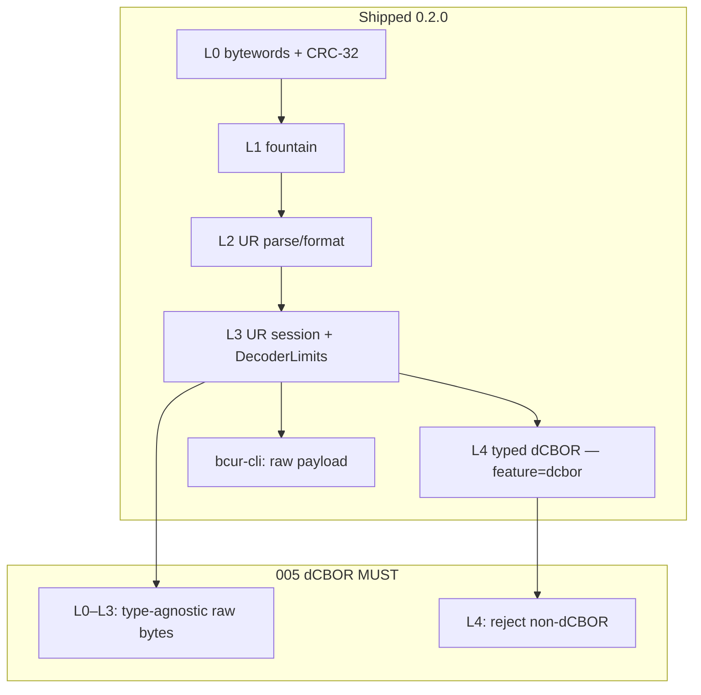

# bcur layers

| Field | Value |
|-------|-------|
| **Status** | Current (0.2.0) |
| **Scope** | Transport vs dCBOR contract |

This note is the written layering contract. It does not restore the deleted
0.1 design spec.

## Contract

**L0–L3 (always built).** A UR type token is a validated label (`[a-z0-9-]+` after ASCII lowercasing). The body is raw bytes plus bytewords CRC. `ur::encode` / `ur::Encoder` do **not** parse or require CBOR. `UrType::bytes()` and `Encoder::bytes` exist so tests and generic hosts can move untyped payloads. This is an intentional split, not an accident, and it matches ur-rs.

**BCR-2020-005** says a UR *message* MUST be dCBOR and that type `bytes` MUST NOT be used except for testing. That MUST is enforced on **L4** (`feature = "dcbor"`): `typed::Ur::from_ur_string` and `MultipartDecoder::message` reject non-dCBOR (`Error::Cbor`). L4 also uses the first registered `dcbor` tag **name** as the type token and strips the tag from the UR body (005 "top-level UR is untagged").

**This crate will not** grow a Blockchain Commons type registry, Envelope, or PSBT module to "satisfy 005." Application types belong in a consumer crate that implements `UrEncodable` / `UrDecodable`.

`Encoder::bytes` is not removed. The type token `bytes` remains legal on the wire. It is the test/generic token.

## Version and layer map

## Layers

| Layer | Path | Contract |
|-------|------|----------|
| L0 bytewords | `crates/bcur/src/bytewords/` | Standard / URI / Minimal + CRC-32 ISO-HDLC. `encode_raw` is not the UR body path. |
| L1 fountain | `crates/bcur/src/fountain/` | Xoshiro256** + Walker-Vose, XOR, shortest-form Part CBOR. Payload is raw bytes. |
| L2 UR parse | `crates/bcur/src/ur/` | `ur:<type>/<body>` and `ur:<type>/<seq>-<count>/<body>`. Type is a label. |
| L3 UR session | `crates/bcur/src/ur/` | `Encoder` / `Decoder` / `DecoderLimits`. No CBOR requirement. |
| L4 typed | `crates/bcur/src/typed/` (`feature = "dcbor"`) | Enforces dCBOR. Implies `std`. No type registry. |
| CLI | `crates/bcur-cli/` | Raw payload, no CBOR wrap. |

Transport remains `no_std` + `alloc` (`--no-default-features`). L4 implies `std`.
